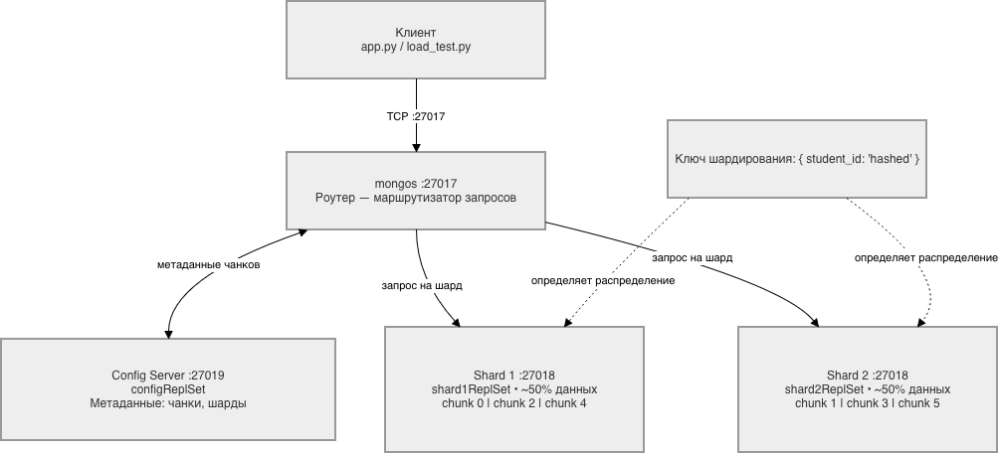

# Итоговое задание по модулю 3  
## Нереляционные базы данных — Шардирование MongoDB
### Выполнил студент Гаенков Даниил Вадимович
---

## 1. Схема базы данных

**База данных:** `university_db`  
**Коллекция:** `students`

### Структура документа

```json
{
  "student_id": 10042,
  "name": "Иванов Иван Иванович",
  "faculty": "Информатика",
  "year": 3,
  "gpa": 4.5,
  "courses": ["Алгоритмы", "БД", "Машинное обучение"]
}
```

| Поле         | Тип      | Описание                              |
|--------------|----------|---------------------------------------|
| `student_id` | Integer  | Уникальный идентификатор студента     |
| `name`       | String   | ФИО студента                          |
| `faculty`    | String   | Название факультета                   |
| `year`       | Integer  | Курс обучения (1–5)                   |
| `gpa`        | Float    | Средний балл (2.5–5.0)                |
| `courses`    | Array    | Список дисциплин текущего семестра    |

MongoDB была выбрана в качестве СУБД, поскольку документо-ориентированная модель хорошо подходит для хранения неоднородных записей студентов (разный набор курсов, дополнительные поля в будущем). Кроме того, MongoDB имеет встроенную поддержку шардирования на уровне архитектуры.

---

## 2. Реализация шардирования

### Архитектура кластера



Кластер состоит из трёх компонентов, что соответствует минимальной production-подобной конфигурации MongoDB:

- **Config Server** (`configsvr`) — хранит метаданные кластера: карту чанков и их расположение по шардам.
- **Два шарда** (`shard1`, `shard2`) — реальные узлы хранения данных, каждый сконфигурирован как replica set (даже с одним членом — это обязательное требование MongoDB для шардов).
- **Mongos** — маршрутизатор запросов. Клиентское приложение взаимодействует только с ним, не зная о внутреннем устройстве кластера.

### Выбор ключа шардирования

```javascript
sh.shardCollection("university_db.students", { student_id: "hashed" })
```

В качестве ключа шардирования выбрано поле `student_id` с **хешированием**.

**Обоснование выбора:**

1. **Равномерное распределение.** Хешированный ключ гарантирует равномерное распределение документов по шардам, избегая "горячих" шардов. Последовательные значения `student_id` (1, 2, 3, …) при диапазонном шардировании попали бы на один шард — хеширование это исключает.

2. **Высокая кардинальность.** `student_id` уникален для каждого студента, что обеспечивает максимальную гранулярность чанков и гибкость балансировки.

3. **Частота запросов.** Основной паттерн доступа — поиск конкретного студента по ID (`find_one({"student_id": X})`), что хорошо работает с хешированным ключом: mongos вычисляет хеш и направляет запрос ровно на один шард.

**Компромисс:** хешированный ключ не поддерживает эффективные диапазонные запросы по `student_id`. Для задачи "найти всех студентов с ID от 1000 до 2000" потребуется scatter-gather по всем шардам. Поскольку такие запросы в данной системе нетипичны (поиск ведётся по имени или факультету через `$regex`), этот компромисс приемлем.

### Инициализация шардирования

```bash
docker-compose up -d
bash init_sharding.sh
```

После выполнения `sh.status()` показывает, что оба шарда активны и коллекция `students` зашардирована.

---

## 3. Python-интерфейс

Реализован консольный интерфейс `app.py` со следующими функциями:

| Пункт меню | Операция MongoDB |
|---|---|
| Добавить студента | `insert_one` |
| Найти студента | `find` с фильтром по ID / имени / факультету |
| Список студентов | `find().limit(n)` |
| Удалить студента | `delete_many` |
| Статистика шардов | `collStats` |

Приложение подключается к `mongos` на `localhost:27017` — клиентский код не знает о существовании шардов, всю маршрутизацию берёт на себя роутер.

Запуск:
```bash
pip install -r requirements.txt
python app.py
```

---

## 4. Нагрузочное тестирование

### Распределение данных по шардам (10 000 документов)

| Шард | Документов | Доля |
|------|-----------|------|
| shard1ReplSet | ~5 030 | 50.3% |
| shard2ReplSet | ~4 970 | 49.7% |

Хешированный ключ обеспечил практически идеальное равномерное распределение (отклонение < 1%).

### Выводы

- Пропускная способность INSERT растёт с увеличением объёма данных — это ожидаемо для пакетных операций (амортизация накладных расходов на соединение).
- READ-операции стабильны ~3 500–3 800 ops/sec: `find_one` по хешированному ключу всегда уходит на один конкретный шард, latency минимальна.
- Распределение данных между шардами равномерное (~50/50), балансировщик MongoDB не был задействован принудительно.

---

## 5. Репозиторий

Структура проекта:

```
university_db/
├── docker-compose.yml
├── init_sharding.sh
├── app.py
├── load_test.py
├── requirements.txt
└── report.md
```

Код: https://github.com/D0r1anGray/Final-task-for-module-3.git
